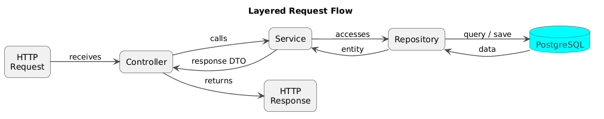

# 🏗️ Application Architecture

This document describes the planned architecture of the Pet Nutrition Tracker API.

The architecture may be adjusted during development if better implementation decisions are discovered.

## 📑 Table of Contents

* [Architecture Style](#architecture-style)
* [Main Modules](#main-modules)
* [Layered Structure](#layered-structure)
* [Package Structure](#package-structure)
---

## Architecture Style

Pet Nutrition Tracker is a modular monolith.

It is one Spring Boot application connected to one PostgreSQL database.

The application is divided into modules based on business functionality. This approach keeps the MVP simple while making the code easier to organize and maintain.

---

## Main Modules


| Module    | Responsibility                              |
| --------- | ------------------------------------------- |
| `auth`    | Registration, login, and JWT authentication |
| `user`    | User account data                           |
| `pet`     | Pet management                              |
| `food`    | Food product management                     |
| `feeding` | Feeding records and feeding history         |
| `weight`  | Pet weight records                          |
| `summary` | Daily food intake calculation               |

---

## Layered Structure





### Controller

* receives HTTP requests;
* validates request data;
* calls the service;
* returns an HTTP response.

### Service

* contains business logic;
* checks that resources belong to the authenticated user;
* coordinates database operations;
* manages transactions when needed.

### Repository

* communicates with PostgreSQL;
* retrieves, saves, and deletes data.

### Entity and DTO

Entities represent data stored in the database.

DTOs are used for API requests and responses. Database entities are not returned directly to the client.

---

## Package Structure

The project uses a package-by-feature structure.

```text
├── auth
├── user
├── pet
├── food
├── feeding
├── weight
├── summary
├── security
├── exception
├── config
```

Each business package may contain its own:

```text
Controller
Service
Repository
Entity
DTOs
Mapper
```

The exact classes will be added when the related functionality is implemented.

---