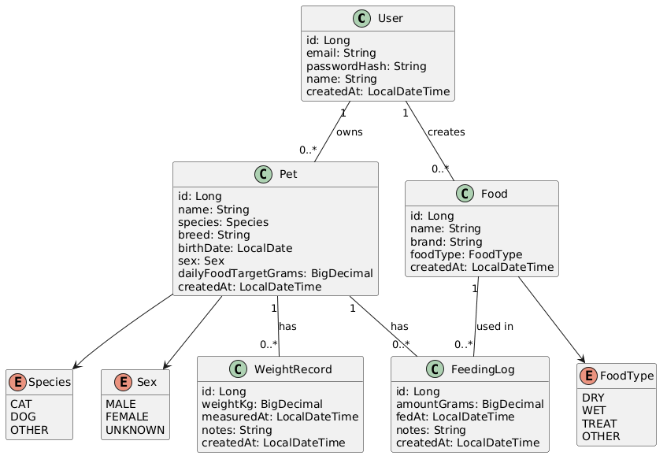

# 📝 Database Design

This document describes the database structure of the Pet Nutrition Tracker API.

## 📑 Table of Contents

- [🔐 Entity Relationship Diagram](#-entity-relationship-diagram)
- [📌 Entities](#-entities)
    - [User](#user)
    - [Pet](#pet)
    - [Food](#food)
    - [FeedingLog](#feedinglog)
    - [WeightRecord](#weightrecord)
- [📌 Enumerations](#-enumerations)
    - [Species](#species)
    - [Sex](#sex)
    - [FoodType](#foodtype)
- [📌 Design Decisions](#-design-decisions)
    - [🍜 Daily Summary](#-daily-summary)

## 🔐 Entity Relationship Diagram



---

## 📌 Entities

### User

Represents an application user.

| Field | Type | Required | Constraints | Description |
|--------|------|----------|-------------|-------------|
| id | Long | ✅ | Primary Key | Unique user identifier |
| email | String | ✅ | Unique | User email used for authentication |
| passwordHash | String | ✅ | - | Encrypted user password |
| name | String | ✅ | - | User's display name |
| createdAt | LocalDateTime | ✅ | Not Null | Account creation date |

**Relationships**

- One user can own multiple pets.
- One user can create multiple food products.

---

### Pet

Represents a pet owned by a user.

| Field | Type | Required | Constraints | Description |
|--------|------|----------|-------------|-------------|
| id | Long | ✅ | Primary Key | Unique pet identifier |
| name | String | ✅ | Not Null | Pet's name |
| species | Species | ✅ | Not Null | Pet species |
| breed | String | ❌ | Nullable | Pet breed |
| birthDate | LocalDate | ❌ | Nullable | Pet's date of birth |
| sex | Sex | ✅ | Not Null | Pet's sex |
| dailyFoodTargetGrams | BigDecimal | ✅ | Positive, Not Null | Recommended daily food amount in grams |
| ownerId | Long | ✅ | Foreign Key | References the owner |
| createdAt | LocalDateTime | ✅ | Not Null | Date and time when the pet was added |

**Relationships**

- Each pet belongs to one user.
- One pet can have multiple feeding records.
- One pet can have multiple weight records.

---

### Food

Represents a food product created by a user.

| Field | Type | Required | Constraints | Description |
|--------|------|----------|-------------|-------------|
| id | Long | ✅ | Primary Key | Unique food product identifier |
| name | String | ✅ | Not Null | Food product name |
| brand | String | ❌ | Nullable | Food brand |
| foodType | FoodType | ✅ | Not Null | Type of food |
| ownerId | Long | ✅ | Foreign Key | References the owner |
| createdAt | LocalDateTime | ✅ | Not Null | Date and time when the food product was added |

**Relationships**

- Each food product belongs to one user.
- One food product can be referenced by multiple feeding records.

---

### FeedingLog

Represents one feeding event.

| Field | Type | Required | Constraints | Description |
|--------|------|----------|-------------|-------------|
| id | Long | ✅ | Primary Key | Unique feeding record identifier |
| petId | Long | ✅ | Foreign Key | References the pet |
| foodId | Long | ✅ | Foreign Key | References the food product |
| amountGrams | BigDecimal | ✅ | Positive, Not Null | Amount of food in grams |
| fedAt | LocalDateTime | ✅ | Not Null | Feeding date and time |
| notes | String | ❌ | Nullable | Optional notes |
| createdAt | LocalDateTime | ✅ | Not Null | Date and time when the record was created |

**Relationships**

- Each feeding record belongs to one pet.
- Each feeding record references one food product.

---

### WeightRecord

Represents one pet weight measurement.

| Field | Type | Required | Constraints | Description |
|--------|------|----------|-------------|-------------|
| id | Long | ✅ | Primary Key | Unique weight record identifier |
| petId | Long | ✅ | Foreign Key | References the pet |
| weightKg | BigDecimal | ✅ | Positive, Not Null | Pet's weight in kilograms |
| measuredAt | LocalDateTime | ✅ | Not Null | Measurement date and time |
| notes | String | ❌ | Nullable | Optional notes |
| createdAt | LocalDateTime | ✅ | Not Null | Date and time when the record was created |

**Relationships**

- Each weight record belongs to one pet.

---

## 📌 Enumerations

### Species

- `CAT`
- `DOG`
- `OTHER`

### Sex

- `MALE`
- `FEMALE`
- `UNKNOWN`

### FoodType

- `DRY`
- `WET`
- `TREAT`
- `OTHER`

---

## 📌 Design Decisions

- The current pet weight is **not stored** in the `Pet` entity.
- Each weight measurement is stored as a separate `WeightRecord`.
- The current weight is determined by the latest `WeightRecord` ordered by `measuredAt`.
- Daily summaries are calculated dynamically and are **not stored** in the database.
- A daily summary is calculated using the pet's daily food target and the sum of feeding amounts for the selected date.
- `FeedingLog` and `WeightRecord` are stored separately because weight measurements do not always occur during feeding.
- When feeding and optional weight are submitted through one combined API request, both records are saved in one transaction.
- If saving the weight record fails, the feeding record is rolled back.
- Food products belong to individual users in the MVP.
- A shared public food catalog may be added in a future version.
- Enum values are stored as strings (`EnumType.STRING`) to keep database values readable and avoid issues when enum values are reordered.


### 🍜 Daily Summary

The daily summary contains:

- daily food target;
- total amount consumed;
- remaining amount.

The total amount consumed is calculated as the sum of all `FeedingLog.amountGrams` values for the selected pet on the selected date.

```
remainingAmount = dailyFoodTargetGrams - totalConsumedGrams
```

If the pet consumes more than its daily target, the remaining amount may be negative.